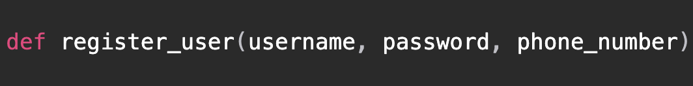
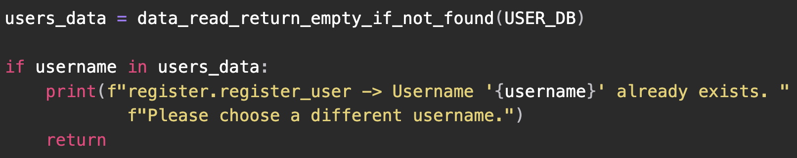
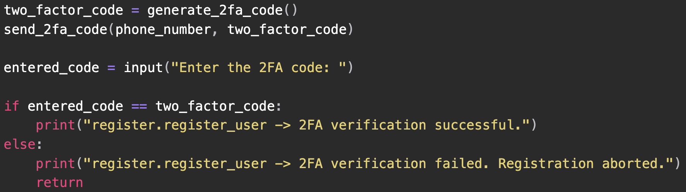
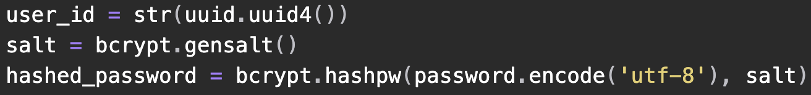
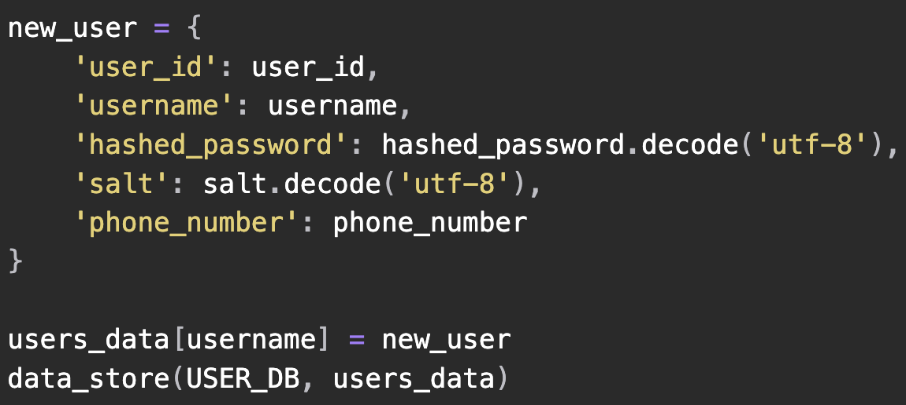

---

# 1 Introduction

This report provides a comprehensive description of the proposed cryptographic simulation for the healthcare provider, St. John's Clinic. The design has been implemented in such a way that it addresses the key security gaps within the clinic's data protection requirements, in order to align with compliance standards, and provide robust safeguarding mechanisms to secure sensitive data.

A current analysis of the cybersecurity practices which St. John's Clinic need to implement for security enhancement falls into the following areas of:

- Authentication
- Key management (and its relevant key lifecycle stages)
- Role based access control
- Cryptographic encryption algorithms
- Secure data transmission

# 2 System description

As this is a simulation, a lot of assumptions have been made. These are documented in [Appendix 4.1](#41-simulation-assumptions). A read of this is highly encouraged, as it will provide insight and understanding around the following implementation.

For the full source code implementation for each of the following sections, please also refer to [Appendix 4.3](#43-implementation-source-code).

## 2.1 Authentication

### 2.1.1 User registration

New users must securely register with the system. The following function facilitates this process.

- **`username`**: a unique identifier for users on the front-end.
- **`password`**: custom password provided by the user.
- **`phone_number`**: placeholder registration data.



User registration is initiated upon successful verification of provided details, with appropriate error messages returned in case of validation issues.



Registration also performs two factor authentication, the below code generates a 2FA code, sends it to the provided phone number (simulated by displaying it on the console), prompts the user to enter the code, and verifies it against the generated code. This ensures an additional layer of security during user registration.



Upon successful registration, the user's details, including a cryptographic salt, a unique user ID and a securely hashed password using the Python `bcrypt` library, are stored in the database for increased security.



User details are stored in the database as a JSON document.



### 2.1.2 User login

The user, with their newly created account, can now login into the system and access the relevant data. The following function takes that into consideration.

- **`username`**: chosen user's username provided during registration.
- **`password`**: user's custom password provided during registration.

```python
def login_user(username, password)
```

Appropriate validation checks are performed, and error messages are returned if necessary.

```python
if username not in users_data:
    print("login.login_user -> Username not found. Please register first.")
    return
```

All the data relating to the user from the database by getting the correct JSON document is captured.

```python
user_data = users_data[username]
stored_password_hash = user_data['hashed_password']
salt = user_data['salt']
phone_number = user_data.get('phone_number', None)
```

Using the Python `bcrypt` library, the entered password's is first hashed. This is compared against the stored hash in the database to confirm that the passwords indeed match.

```python
if bcrypt.checkpw(
    entered_password.encode('utf-8'),
    stored_password_hash.encode('utf-8'))
```

Two factor authentication is called again to provide an additional layer of security for the login process as well. If the generated code matches the user's inputted code, then an RSA public key is generated for data transmission purposes later on (see [2.4](#24-data-transmission)).

```python
two_factor_code = generate_2fa_code()
send_2fa_code(phone_number, two_factor_code)

entered_code = input("Enter the 2FA code: ")

if entered_code == two_factor_code:
    print("login.login_user -> Login successful.")
    public_key = refresh_rsa_key(user_data["user_id"])
    return user_data['user_id'], public_key
```

### 2.1.3 Single Sign-on (SSO)

[2.1.2](#212-user-login) considered homegrown SSO, i.e. a username and password based authentication within the system. The SSO here accounts for external identity authentication, where a third party will be responsible for performing the authentication and returning the result of it.

- **`username`**: unique identifier of the third party SSO system.

```python
def single_sign_on(username)
```

Validation checks are performed, returning appropriate error messages where necessary.

```python
if username not in third_party_data:
    raise ValueError(f"sso.single_sign_on -> Username {username} not found. "
                    f"Please register with the third party provider first.")
```

The user's data from the third party's database is retrieved to check whether the user is registered with the third party. If so, a new JSON document, specifically for external SSO, is created.

```python
third_party_data = third_party_data[username]

if third_party_data:
    new_user = {
        'user_id': str(uuid.uuid4()),
        'username': username,
        'third_party_status': True
    }
```

This is then stored within the healthcare provider's user database.

```python
users_data[username] = new_user
data_store(USER_DB, users_data)
```

## 2.2 Key management

### 2.2.1 Key generation

#### 2.2.1.1 AES

The following function generates a random AES key for symmetric encryption and decryption. With `os.urandom(32)`, the key is 32 bytes (256 bits) in length, allowing for a good balance between both security and performance.

```python
def generate_aes_key():
    key = os.urandom(32)
    return key
```

#### 2.2.1.2 RSA

The function below generates a key pair consisting of an RSA public and private key, used for data transmission purposes (see [2.4](#24-data-transmission)).

- **`public_exponent`**: A component for generating keys, with `65537` is the default for most RSA keys.
- **`key_size`**: The size of the key in bits, with `2048` being a standard size prioritising security and usability.
- **`backend`**: The backend processes, with `default_backend()` being the backend provided by the library itself.

An RSA `public_key` can also be derived from the generated RSA private key.

```python
def generate_key_pair():
    private_key = rsa.generate_private_key(
        public_exponent=65537,
        key_size=2048,
        backend=default_backend()
    )
    public_key = private_key.public_key()
    return private_key, public_key
```

### 2.2.2 Key storage

#### 2.2.2.1 AES

Each user will have a corresponding symmetric AES key for cryptographic operations. This needs to be access system wide across the multiple clinic services, ensuring that the key is consistent and not corrupted.

- **`user_id`**: ID of the user to store the AES key under.
- **`key`**: the actual AES key to be stored.

```python
def store_aes_key(user_id, key)
```

The data from the AES HSM (Hardware Security Module) is first initially retrieved.

```python
try:
    with open(HSM_DB, 'r') as file:
        json_data = json.load(file)
except FileNotFoundError:
    json_data = {"aes_keys": []}
```

By iterating through the `aes_keys` JSON collection, it attempts to first find if an entry for that user already exists. If not however, a new entry into the JSON collection is made, writing both the user's ID and their corresponding AES key. It then writes this to the AES HSM.

```python
for entry in json_data["aes_keys"]:
    if entry["user_id"] == user_id:
        entry["key"] = key.hex()
        break
    else:
        json_data["aes_keys"].append({"user_id": user_id, "key": key.hex()})

with open(HSM_DB, 'w') as file:
    json.dump(json_data, file, indent=2)
```

#### 2.2.2.2 RSA

The function below stores the user's RSA key under their ID.

- **`user_id`**: ID of the user to store the RSA key under.
- **`key`**: the actual RSA key to be stored.
- **`file_path`**: the path to the RSA HSM JSON file.

```python
def replace_or_insert_key_from_file
(
    user_id,
    new_key,
    file_path="data/rsa_hsm.json"
)
```

The logic of this function is exactly similar to the AES key store function.

However, the raw RSA key object in bytes cannot be stored in the JSON document, so it needs to be converted into a PEM string. The following two functions perform this conversion, one for each type of RSA key (public and private).

- **`encoding`**: specifies that the PEM encoder should be used.
- **`format`**: format for the private key, with `PKCS8` being the widely used standard.
- **`encryption_algorithm`**: the encryption algorithm, set to `NoEncryption` since simulated HSM takes care of this

```python
def pem_convert_private_key(key):
    pem_format = key.private_bytes(
        encoding=serialization.Encoding.PEM,
        format=serialization.PrivateFormat.PKCS8,
        encryption_algorithm=serialization.NoEncryption()
    )
    return pem_format.decode('utf-8')

def pem_convert_public_key(key):
    pem_format = key.public_bytes(
        encoding=serialization.Encoding.PEM,
        format=serialization.PublicFormat.SubjectPublicKeyInfo
    )
    return pem_format.decode('utf-8')
```

### 2.2.3 Key retrieval

#### 2.2.3.1 AES

The stored AES keys need to be retrieved for any symmetric encryption and decryption processes for the relevant user, and the following function considers this.

- **`user_id`**: ID of the user under which the AES key is stored under.

```python
def retrieve_key(user_id)
```

By iterating through the database entries, it tries to find the corresponding key entry that matches the given `user_id`. It then returns the AES key in a usable format.

```python
key_entries = data_read(HSM_DB)

for entry in key_entries["aes_keys"]:
    if entry["user_id"] == user_id:
        return bytes.fromhex(entry["key"])
```

#### 2.2.3.2 RSA

The logic for RSA key retrieval is exactly the same as AES key retrieval.

Since the RSA private key was stored as a PEM string (see [2.2.2.2](#2222-rsa)), it needs to be converted back into a usable key format. The following two functions are implemented to perform this operation, one for the private key and the other for the public key.

- **`pem_string.encode()`**: the PEM string converted into bytes
- **`password`** if any password protection was applied to the PEM string, in this case it is set to `None` since the HSM takes care of this
- **`backend`**: The backend processes, with `default_backend()` being the backend provided by the library itself.

```python
def load_private_key_from_pem_string(pem_string):
    private_key = serialization.load_pem_private_key(
        pem_string.encode(),
        password=None,
        backend=default_backend()
    )
    return private_key

def load_public_key_from_pem_string(pem_string):
    public_key = serialization.load_pem_public_key(
        pem_string.encode(),
        backend=default_backend()
    )
    return public_key
```

### 2.2.4 Key expiry rotation

#### 2.2.4.1 AES

The AES keys stored in the HSM need to be rotated and expired periodically in order to be cryptographically secure. In the event the HSM is breached and access to the AES key is gained, since the key has been rotated, the data still cannot be decrypted regardless. Therefore, the following function implements this.

- **`user_id`**: ID of the user under to find and expire the AES key.

```python
def expire_aes_key(user_id)
```

The current AES key is first retrieved based on the user's ID. A new key is then generated.

```python
old_aes_key = retrieve_key(user_id)
new_aes_key = generate_aes_key()
```

Looping through the JSON data, the user's record (see [2.3](#23-record-management)) is fetched and the cipher text is decrypted to plaintext.

```python
for record in records_data["records"]:
    if record["owner_id"] == user_id:
        record["data"] = aes_data_decrypt(old_aes_key, record["data"])
```

Since the data is in plaintext, the the `new_aes_key` can be used to encrypt the plaintext and overwrite the record's old cipher text.

```python
if record["owner_id"] == user_id:
    # ...previous code

    ciphertext = aes_encrypt(new_aes_key, record["data"].encode())
    serialized_ciphertext = base64.b64encode(ciphertext).decode()
    record["data"] = serialized_ciphertext
```

#### 2.2.4.2 RSA

There is no key expiry implemented for RSA keys. This is because each time the user logins, both their RSA public and private keys are dynamically re-generated so no key rotation is required.

## 2.3 Record management

In this system, data is organised into records, which serve as the fundamental units of information storage. Users from the various clinical services interacting with the system, have the capability to both create new records and store them within the system's database, as well as retrieve existing records as needed. These records are structured as JSON objects.

### 2.3.1 Encryption

For data at rest, AES symmetric encryption has been used. The following function performs this operation.

- **`key`**: the user's generated AES key.
- **`data`**: the plaintext data to encrypt

```python
def aes_encrypt(key, data)
```

The AES key length should be 32 bytes. This also gives assurance that the AES key is only generated by the crypto system and no external keys are being used. If data is encrypted with an invalid key, the cipher text is corrupted and cannot be recovered to its original state.

```python
if len(key) != 32:
    raise ValueError("AES key must be 32 bytes long for AES-256")
```

An initialisation vector, a random binary string of 16 bytes (or 128 bits), helps to ensure cryptographic randomness and true variance in the cipher texts.

```python
iv = os.urandom(16)
```

Here, a new cryptographic cipher is created, which is an object that can perform the encryption process.

- **`algorithms.AES(key)`**: specifies AES symmetric encryption using the `key`.
- **`modes.CFB(iv)`**: states that CFB (Cipher Feedback) mode of operation is used.
- **`backend`**: The backend processes, with `default_backend()` being the backend provided by the library itself.

```python
cipher = Cipher(
    algorithms.AES(key),
    modes.CFB(iv),
    backend=default_backend())
```

A new encryptor is created from the cipher object to perform the encryption on the data.

```python
encryptor = cipher.encryptor()
```

The encryptor created the cipher text by encrypting each character in its internal buffer.

```python
ciphertext = encryptor.update(data) + encryptor.finalize()
```

The final cipher text is returned as a concatenation of the initialisation vector and the newly generated cipher text. This will be required in the decryption process (see [2.3.2](#232-decryption)).

```python
return iv + ciphertext
```

### 2.3.2 Decryption

To convert the cipher text back into a plain text readable form, the decryption process has to be performed, and this function considers this.

- **`aes_key`**: the user's generated AES key.
- **`data`**: the plaintext data to decrypt

```python
def aes_data_decrypt(aes_key, data)
```

In [2.3.1](#231-encryption) the final cipher text was a combination of the initialisation vector and the cipher text components. Using string splicing, the cipher text is split up.

```python
iv = ciphertext[:16]
actual_ciphertext = ciphertext[16:]
```

The user's AES key is checked to see if its of the correct length, and also verifies that only keys issues by the crypto system are used.

```python
if len(aes_key) != 32:
    raise ValueError("AES key must be 32 bytes long for AES-256")
```

A cipher object must be formed again using the exact same parameters and values as in [2.3.1](#231-encryption). This is to form a `decryptor` object.

```python
cipher = Cipher(algorithms.AES(aes_key), modes.CFB(iv), backend=default_backend())
decryptor = cipher.decryptor()
```

The `decryptor` performs the decryption process by taking each character in its internal buffer and converting that to its relevant plaintext counterpart.

```python
decrypted_data = decryptor.update(actual_ciphertext) + decryptor.finalize()
```

Finally, as the `decryptor` returns the plain text in bytes, and this is converted to a string to be read.

```python
return decrypted_data.decode()
```

### 2.3.3 Role Based Access Control (RBAC)

The Role Based Access Control (RBAC), is a method of access control where users are granted certain privileges or access to specific system properties based on the permissions they have. Access decisions are solely dependent on the user's permissions rather than the actual identity of the users themselves. This approach allows for easier access management since permissions can be quickly assigned or revoked by administrators.

The RBAC logic for this simulation is implemented as a Python wrapper. This means that the role check logic can be executed for each record operation that the user attempts to access.

- **`func`**: takes a whole function that the wrapper modifies.
- **`wrapper(...)`**: function that modifies or extends another function.
- **`owner_id`**: the ID of the owner of the record.
- **`args, kwargs`**: to accept any number of extra parameters from the wrapped function.

```python
def role_check_decorator(func):
    def wrapper(owner_id, *args, **kwargs):
```

A validation check allows to verify whether the owner has any roles at all in the first place.

```python
if owner_id in user_roles_data:
    user_roles = user_roles_data[owner_id]["roles"]
else:
    print(f"role_check.role_check_decorator -> User with ID {owner_id} not found in user roles data.")
```

Searching the role permissions database, it then checks whether the role actually exists in the first place, serving as another validation check.

```python
if owner_id in user_roles_data:
    # ...previous code

    for role in user_roles:
        if role in role_permissions_data:
            permission_name = kwargs.get("permission", "").upper()
        else:
            print(f"role_check.role_check_decorator -> Role {role} not found in role permissions data.")
```

The function then compares whether the claimed permission is assigned to the user. If so, the function resumes execution and program flow resumes. However, an appropriate error is raised if this is not the case.

```python
if role in role_permissions_data:
    # ...previous code

    if permission_name in role_permissions_data[role]["permissions"]:
        return func(owner_id, *args, **kwargs)
    else:
        raise PermissionError(
                            f"role_check.role_check_decorator -> User with ID {owner_id} "
                            f"does not have required permissions for this operation.")
```

### 2.3.4 Store records

When users interact with the various clinic's systems, data may be stored in the form of records when certain operations are performed.

- **`@role_check_decorator`**: calling the role check logic.
- **`owner_id`**: ID of the record's owner.
- **`data`**: the data (in plaintext) to be stored.
- **`metadata`**: any additional data to be also stored.
- **`permission`**: the permission of the user performing the operation.
- **`decrypted_data`**: the decrypted transit data from the RSA data transmission.
- **`individual_access`**: if specific users are allocated record access (see [2.5.1](#2351-individual-access-record-retrieval)).

```python
@role_check_decorator
def record_store
(
    owner_id,
    data,
    meta_data,
    permission,
    decrypted_data,
    individual_access=None
):
```

First, the user's AES key is retrieved. Using that key, the decrypted data from the RSA data transmission output (see [2.4](#24-data-transmission)) is re-encrypted again using AES, since the data is now at rest.

```python
key = retrieve_key(owner_id)
json_data = json.dumps(decrypted_data, indent=2)
ciphertext = aes_encrypt(key, json_data.encode())
serialized_ciphertext = base64.b64encode(ciphertext).decode()
```

A new JSON document is made with the relevant data and is then stored within the records database.

```python
record_id = str(uuid.uuid4())

json_data["records"].append(
    {
        "record_id": record_id,
        "owner_id": owner_id,
        "data": serialized_ciphertext,
        "meta_data": meta_data,
        "individual_access": individual_access
    })
```

### 2.3.5 Retrieve records

The stored records also need to be read across the multiple clinic's systems, so this function accounts for this.

- **`@role_check_decorator`**: calling the role check logic.
- **`owner_id`**: ID of the record's owner.
- **`patient_id`**: ID patient referenced in the record.
- **`permission`**: permission of the user attempting to perform this operation.

```python
@role_check_decorator
def record_retrieve(owner_id, patient_id, permission)
```

The AES key for the user is retrieved.

```python
aes_key = retrieve_key(owner_id)
```

From the the records database, the record that matches the given search parameters is returned.

```python
for record in records_data["records"]:
    if record["owner_id"] == owner_id and record["meta_data"]["patient_id"] == patient_id:
```

The data from that record is decrypted and added to a list. This is then present to the user in a visual format.

```python
# ...previous code
    record["data"] = aes_data_decrypt(aes_key, record["data"])
    records_list.append(record)

return records_list
```

#### 2.3.5.1 Individual access record retrieval

Another additional requirement, especially for third party data being stored in the company, is the ability for owners to delegate access to specific users of the clinic, since it is their intellectual property after all.

- **`record_id`**: ID of the record being retrieved.
- **`user_id`**: ID of the user attempting to retrieve the record.

```python
def record_retrieve_by_id(record_id, user_id)
```

To get all the matching records, this line filters a list of records from the database based on the record's ID.

```python
record = list(filter(lambda x: x["record_id"] == record_id, records_data["records"]))[0]
```

The function then checks whether the user has individual access to this specific record. If this isn't the case, then return an appropriate error message.

```python
if user_id in record["individual_access"]:
    # next code...
else:
    raise PermissionError(
        f"record_retrieve.record_retrieve_by_id -> User with ID {user_id} "
        f"does not have required permissions for this operation."
    )
```

The owner of the record has their corresponding AES key retrieved and the record's cipher text is decrypted.

```python
# ...previous code

aes_key = retrieve_key(record["owner_id"])
record["data"] = aes_data_decrypt(aes_key, record["data"])
return record
```

## 2.4 Data transmission

Data needs to be stored and read across the various systems in the clinic. During the transmission, this data needs to remain secure and unreadable. The algorithm of choice for this is RSA asymmetric key encryption.

### 2.4.1 Encryption

The function below implements RSA encryption, using Python's RSA cryptographic library.

- **`data`**: the data in transit to be encrypted.
- **`public_key_pem`**: the PEM string of the user's RSA public key.

```python
def rsa_encrypt(data, public_key_pem)
```

THe public key PEM string needs to be converted into a usable key object.

```python
public_key = load_public_key_from_pem_string(public_key_pem)
```

The variable below uses the library's `.encrypt()` function to encrypt the data.

- **`data.encode()`**: convert the plaintext data into bytes.
- **`padding.OAEP`**: specifies the padding scheme to be used.
- **`mgf`**:: specify the Mask Generation Function used, in this case, the SHA256 algorithm.
- **`label`**: any additional labels to be included within the padding, but is not required here.

```python
ciphertext = public_key.encrypt(
        data.encode(),
        padding.OAEP(
            mgf=padding.MGF1(algorithm=hashes.SHA256()),
            label=None
        )
    )

return ciphertext
```

### 2.4.2 Decryption

The encrypted data in transit needs to be appropriately decrypted when it has reached its destination. The following functions meet this criteria.

- **`ciphertext`**: the data in transit to be decrypted.
- **`private_key_pem`**: the PEM string of the user's RSA private key.
- **`private_key`**: user's RSA private key as usable key object.
- **`padding.OAEP(...)`**: padding scheme with the parameters set for SHA-256 decryption (see [2.4.1](#241-encryption)).
- **`plaintext.decode("utf-8")`**: convert the resulting plaintext back into a string.

```python
def rsa_decrypt(ciphertext, private_key_pem):
    private_key = load_private_key_from_pem_string(private_key_pem)
    plaintext = private_key.decrypt
    (
        ciphertext,
        padding.OAEP
        (
            mgf=padding.MGF1(algorithm=hashes.SHA256()),
            algorithm=hashes.SHA256(),
            label=None
        )
    )
    return plaintext.decode("utf-8")
```

The RSA data decryption process needs to be called every time a record store or access request is sent to the backend. Implementing this as a Python wrapper function (similar to `role_check_decorator` in [2.3.3](#233-role-based-access-control-rbac)) allows this logic to be appended to any record operation.

- **`func`**: the function the decorator is wrapper around.
- **`owner_id`**: ID of the record's owner.
- **`args, kwargs`**: accept any number of additional parameters from the wrapped function.

```python
def rsa_decrypt_data_decorator(func):
    def wrapper(owner_id, data, *args, **kwargs):
```

The RSA HSM is searched to find the relevant RSA private key PEM string associated with the record owner.

```python
rsa_hsm_data = data_read("data/rsa_hsm.json")
    for key_info in rsa_hsm_data["rsa_keys"]:
        if key_info["user_id"] == owner_id:
            private_key_pem = key_info["key"]
```

The transmission data is then decrypted using the previously mentioned `rsa_decrypt()` method.

```python
decrypted_data = rsa_decrypt(data, private_key_pem)
```

At the end, the original function's arguments are returned back to it, passing any new values that the parameters take, where appropriate.

```python
return func(
    owner_id=owner_id,
    data=data,
    meta_data=kwargs.get("meta_data"),
    permission=kwargs.get("permission"),
    decrypted_data=decrypted_data,
    individual_access=kwargs.get("individual_access")
)
```

# 3 Addressing requirements

## 3.1 Cryptographic algorithms and protocols

### 3.1.1 AES

AES symmetric key encryption has been chosen to be used for the data at rest, i.e. the data in MediCloud or data that is not in transit in general.

Highly efficient and computationally fast – ideal for encrypting and decrypting data of large volumes without causing a significant impact on performance. This is obviously dependent on the clinic's hardware, but even despite that, AES can optimally use the resources its been allocated. It is thus suitable for a healthcare provider since they will have a lot of data traversing between the different clinical services at multiple times and quickly too. The same key is used for both encryption and decryption operations, simplifying key management processes and ensuring efficient, quick data access throughout the system.

Key size is sufficiently large enough that prevents brute force attacks, so sensitive data at rest remains confidential and protected from unauthorised access. AES is an industry standard, and has remained to be for many years due to extensive security analysis by cryptographers, so it is a trusted framework that can be reliably used.

### 3.1.2 RSA

RSA asymmetric encryption has been chosen for encrypting data that is in transit, that being the data that is propagated around the various systems of the clinic.

Since data transmission can potentially occur over unsecured networks, it is important that confidentiality is ensured at all times. As seen in [2.1.2](#212-user-login), the public key is not secured at all and widely distributed to the simulated client side but the private key isn't. This ensures that data encrypted with the public key can only be decrypted with the corresponding user's private key, so sensitive data is protected.

Although not implemented, the clinic would highly benefit from the use of a PKI (Public Key Infrastructure) to manage multiple public keys efficiently. If the clinic does grow in size in its user base or external partners, then this algorithm ensures scalability.

## 3.2 Compliance and standards

The proposed cryptographic solution needs to comply with relevant data protection regulations. These include:

- **General Data Protection Regulation (GDPR)**: European Union (EU) regulation for the processing of personal data of users within the EU region and the European Economic Area (EEA) [@wolford].
- **California Consumer Privacy Act (CCPA)**: A Californian law granting specific rights to individuals with a Californian citizenship, and regards their personal information with appropriate choices to either access, delete, or opt-out of their data being sold [@genesis].
- **Payment Services Directive 2 (PSD2)**: Another EU regulation covering payment services and providers within the same EEA region, with the aim of enhancing security within financial operations [@ukfinance].

### 3.2.1 Data encryption

By encrypting data at both rest and transit (see [3.1.1](#311-aes) and [3.1.2](#312-rsa)) at both stationary (rest) and in transit reaffirms the "security by design" principle highlighted in GDPR and CCPA. The encryption protocols, along with storing that data, meet requirements such as Article 32 of GDPR [@intersoftconsulting1] and Section 1798.100 of CCPA [@casetext1].

### 3.2.2 Key management

Albeit simulated, the use of secure key management practices such as a Hardware Security Module (HSM) for robust key storage is vital for maintaining the integrity and confidentiality of keys. Stages such as key rotation can help in mitigating the associated risks of any compromised keys [@warner2022].

### 3.2.3 Access control

The implementation of the role-based access control system (RBAC) alongside the encryption provided via AES and RSA further strengthens data protection by only allowing access to certain individuals based on their roles and permissions. The reason for this is to adhere to the principle of data "minimisation" outlined in Article 5 of GDPR [@intersoftconsulting2] and Section 1798.110 of CCPA [@casetext2]. By only allowing the most minimal privileges for the user, this allows users to still perform their jobs and functionality whilst also preventing unauthorised data access or any leaks.

# 4 Appendices

## 4.1 Simulation assumptions

### 4.1.1 System definition

**NOTE**: This implementation is **NOT** intended to be defined as a "system" or "cryptosystem" of any kind. Rather, each module or function is treated as a separate API (that implements the cryptographic logic). It would ultimately be the responsibility of the developer to combine these APIs and form a coherent "system" of both a back-end and front-end, and facilitate the appropriate communication between them.

### 4.1.2 Simulation scope

- Certain aspects like physical hardware, secure deployment environments, and network infrastructure are out of scope and are assumed to be secure already.
- Only workflows involving cryptographic protocols and access controls are focussed on.
- A simple command line interface with appropriate annotations via `print()` statements is implemented – no advanced GUI.

### 4.1.3 Data

- Sample data within the [`data`](https://github.com/iArcanic/iss-cw/tree/main/data) folder.
- No real production data that is reflective of a real-time system is used.
- Data in a real-time system may use an SQL relational database, but this simulation uses simple JSON objects.

### 4.1.4 External dependencies

- HSMs (Hardware Security Module), and PKIs (Public Key Infrastructure) are simulated as simple JSON objects.
- Third-party key repositories and certification authorities are not simulated.

### 4.1.5 Compliance requirements

- Simulation attempts to provide compliance with GDPR, CCPA, and PSD2.
- Final compliance responsibility ultimately lies with the healthcare provider

### 4.1.6 Authentication

- Advanced enterprise IAM (Identity Access Management) not implemented in simulation.
- Only simple username and password-based authentication suffices for simulation.
- More advanced hardware-based authentication controls, like biometric or facial are up to the company to consider.

### 4.1.7 Roles

- All JSON "databases" are stored in the healthcare provider's cloud service, MediCloud.
- Users are granted roles by an admin manually beforehand.
- User roles assumed, like doctor, nurse, and so on based on common healthcare provider norms.
- Only core attributes simulated - advanced RBAC left for actual enterprise integration.

### 4.1.8 Cryptographic algorithms

- Basic implementation of industry-standard encryption algorithms simulated to a basic level.
- Additional platform-specific encryption algorithms are not implemented.

### 4.1.9 Key management

- Only essential stages in the key management lifecycle are able to be simulated – generation, storage, usage, and rotation.
- Actual HSM synchronisation protocols are not considered.

### 4.1.10 Exception handling

- Core exception handling is done but extensive error flows are not implemented.

### 4.1.11 Concurrency

- Only one test case workflow is run at a time.
- Parallel processing capabilities of different workflows are not considered.

### 4.1.12 Performance

- Code optimisation not achieved to full capabilities.
- Large-scale data, user and cryptographic operation performance testing not done.

## 4.2 GitHub repository

Link to GitHub repository, containing full code and installation documentation:

> [https://github.com/iArcanic/iss-cw](https://github.com/iArcanic/iss-cw)

## 4.3 Implementation source code

### 4.3.1 Authentication

#### 4.3.1.1 [`register.py`](https://github.com/iArcanic/iss-cw/blob/main/src/authentication/register.py)

```python
import uuid

import bcrypt

from src.authentication.two_fa import generate_2fa_code, send_2fa_code
from src.data_manager import *

# User database simulation
USER_DB = "data/user_db.json"


def register_user(username, password, phone_number):
    users_data = data_read_return_empty_if_not_found(USER_DB)

    # Check if the username already exists in the database
    if username in users_data:
        print(f"register.register_user -> Username '{username}' already exists. "
            f"Please choose a different username.")
        return

    # Generate a 2FA code
    two_factor_code = generate_2fa_code()

    # Simulate sending the 2FA code to the user
    send_2fa_code(phone_number, two_factor_code)

    # Prompt the user to enter the received 2FA code
    entered_code = input("Enter the 2FA code: ")

    # Check if the entered code matches the generated 2FA code
    if entered_code == two_factor_code:
        print("register.register_user -> 2FA verification successful.")
    else:
        print("register.register_user -> 2FA verification failed. Registration aborted.")
        return

    # Generate a unique user_id using UUID
    user_id = str(uuid.uuid4())

    # Generate a random salt
    salt = bcrypt.gensalt()

    # Combine the password with the salt and hash it
    hashed_password = bcrypt.hashpw(password.encode('utf-8'), salt)

    # Create a new user entry
    new_user = {
        'user_id': user_id,
        'username': username,
        'hashed_password': hashed_password.decode('utf-8'),  # Convert bytes to string for JSON serialization
        'salt': salt.decode('utf-8'),  # Convert bytes to string for JSON serialization
        'phone_number': phone_number
    }

    # Add the new user to the database
    users_data[username] = new_user

    # Save the updated database to the file
    data_store(USER_DB, users_data)

    print(f"register.register_user -> User '{username}' registered successfully. "
          f"Login with your new account to continue.")
```

#### 4.3.1.2 [`login.py`](https://github.com/iArcanic/iss-cw/blob/main/src/authentication/login.py)

```python
import bcrypt

from src.authentication.two_fa import generate_2fa_code, send_2fa_code
from src.data_manager import *
from src.key_management.rsa_key_manager import *

# User database simulation
USER_DB = "data/user_db.json"


def login_user(username, password):
    users_data = data_read(USER_DB)

    # Check if the username exists in the database
    if username not in users_data:
        print("login.login_user -> Username not found. Please register first.")
        return

    if username in users_data and "third_party_status" in users_data[username]:
        print("login.login_user -> Please use SSO to login.")
        return

    user_data = users_data[username]
    stored_password_hash = user_data['hashed_password']
    salt = user_data['salt']
    phone_number = user_data.get('phone_number', None)

    # Get the user's password
    if password is None:
        entered_password = input("Enter your password: ")
    else:
        entered_password = password

    # Verify the entered password
    if bcrypt.checkpw(entered_password.encode('utf-8'), stored_password_hash.encode('utf-8')):
        # If the password is correct, proceed with 2FA verification
        two_factor_code = generate_2fa_code()
        send_2fa_code(phone_number, two_factor_code)

        entered_code = input("Enter the 2FA code: ")

        if entered_code == two_factor_code:
            print("login.login_user -> Login successful.")
            # Every time the user logins the RSA key is regenerated
            # Used for transferring data across multiple clinic services
            public_key = refresh_rsa_key(user_data["user_id"])
            return user_data['user_id'], public_key
        else:
            print("login.login_user -> 2FA verification failed. Login aborted.")
    else:
        print("login.login_user -> Incorrect password. Login aborted.")
```

### 4.3.1.3 [`sso.py`](https://github.com/iArcanic/iss-cw/blob/main/src/authentication/sso.py)

```python
import uuid

from src.data_manager import *

# Third party provider database simulation
THIRD_PARTY_DB = "data/third_party_db.json"

# User database simulation
USER_DB = "data/user_db.json"


def single_sign_on(username):
    # Read all user entries from the third party provider database
    third_party_data = data_read(THIRD_PARTY_DB)

    # Read all user entries from the Users database
    users_data = data_read_return_empty_if_not_found(USER_DB)

    if username not in third_party_data:
        raise ValueError(f"sso.single_sign_on -> Username {username} not found. "
                        f"Please register with the third party provider first.")

    # Get the correct user entry
    third_party_data = third_party_data[username]

    if third_party_data:
        # Make a new entry
        new_user = {
            'user_id': str(uuid.uuid4()),
            'username': username,
            'third_party_status': True
        }

        # Make a new entry in the Users database
        users_data[username] = new_user

        # Add the new SSO user to the database
        data_store(USER_DB, users_data)

        # Third party identity provider would do their own authentication logic here
        print("sso.single_sign_on -> Third party authentication successful "
                "Authentication logic by the third party provider.")
    else:
        # Terminate on unsuccessful SSO login
        print("sso.single_sign_on -> Third party authentication failed. SSO login aborted.")
```

### 4.3.2 Key management

#### 4.3.2.1 AES key functions

##### 4.3.2.1.1 [`key_gen.py`](https://github.com/iArcanic/iss-cw/blob/main/src/key_management/key_gen.py)

```python
import os


def generate_aes_key():
    key = os.urandom(32)
    return key
```

##### 4.3.2.1.2 [`key_store.py`](https://github.com/iArcanic/iss-cw/blob/main/src/key_management/key_store.py)

```python
import base64

from src.decryption import aes_data_decrypt
from src.encryption import aes_encrypt
from src.key_management.key_gen import generate_aes_key
from src.key_management.key_retrieve import *

# Hardware Security Module (HSM) for AES keys simulation
HSM_DB = "data/hsm.json"

# Records database simulation
RECORDS_DB = "data/records_db.json"


def store_aes_key(user_id, key):
    try:
        with open(HSM_DB, 'r') as file:
            # Read all key entries from HSM
            json_data = json.load(file)
    except FileNotFoundError:
        # If file is not found then make an empty aes_keys JSON collection
        json_data = {"aes_keys": []}

    for entry in json_data["aes_keys"]:
        if entry["user_id"] == user_id:
            # Store AES key as hex in database
            entry["key"] = key.hex()
            break
        else:
            # If user_id not found, insert a new entry using the given AES key
            json_data["aes_keys"].append({"user_id": user_id, "key": key.hex()})

    with open(HSM_DB, 'w') as file:
        json.dump(json_data, file, indent=2)
```

##### 4.3.2.1.3 [`key_retrieve.py`](https://github.com/iArcanic/iss-cw/blob/main/src/key_management/key_retrieve.py)

```python
from src.data_manager import *

# Hardware Security Module (HSM) for AES keys simulation
HSM_DB = "data/hsm.json"


def retrieve_key(user_id):
    # Read all key entries from HSM
    key_entries = data_read(HSM_DB)

    for entry in key_entries["aes_keys"]:
        # Get the correct record
        if entry["user_id"] == user_id:
            # Return AES key from hex into a usable format
            return bytes.fromhex(entry["key"])

    print(f"key_retrieve.retrieve_key -> Key for user {user_id} not found in {HSM_DB}!")
    return None
```

##### 4.3.2.1.4 `key_expire.py`

> NOTE: The `expire_aes_key` function is implemented within the [`key_store.py`](https://github.com/iArcanic/iss-cw/blob/main/src/key_management/key_store.py) (see [4.3.2.1.2](#43212-key_storepy)) rather than in its own separate file. For clarity and understanding purposes, it has been presented in here as its own distinct file.

```python
import base64

from src.decryption import aes_data_decrypt
from src.encryption import aes_encrypt
from src.key_management.key_gen import generate_aes_key
from src.key_management.key_retrieve import *

# Hardware Security Module (HSM) for AES keys simulation
HSM_DB = "data/hsm.json"

# Records database simulation
RECORDS_DB = "data/records_db.json"

# This has to be highly transactional.
# For any failures, old key should be rolled back, including data encryption and decryption
def expire_aes_key(user_id):

    # Read all record entries from Records database
    records_data = data_read(RECORDS_DB)

    # Get AES old key
    old_aes_key = retrieve_key(user_id)

    # Make a new AES key
    new_aes_key = generate_aes_key()

    # Store new key under the given user_id
    store_aes_key(user_id, new_aes_key)

    for record in records_data["records"]:
        # Get the correct record
        if record["owner_id"] == user_id:
            # Decrypt the data of that record with the old AES key
            record["data"] = aes_data_decrypt(old_aes_key, record["data"])

            # Encrypt the data of that record with the new key
            ciphertext = aes_encrypt(new_aes_key, record["data"].encode())

            # Serialise the ciphertext so it can be stored as JSON
            serialized_ciphertext = base64.b64encode(ciphertext).decode()

            # Overwrite the data of that record with the new serialised ciphertext
            record["data"] = serialized_ciphertext

    # Write to Records database
    data_store(RECORDS_DB, records_data)
```

#### 4.3.2.2 [`rsa_key_manager.py`](https://github.com/iArcanic/iss-cw/blob/main/src/key_management/rsa_key_manager.py)

```python
import json

from cryptography.hazmat.backends import default_backend
from cryptography.hazmat.primitives import hashes
from cryptography.hazmat.primitives import serialization
from cryptography.hazmat.primitives.asymmetric import padding
from cryptography.hazmat.primitives.asymmetric import rsa


def replace_or_insert_key_from_file(user_id, new_key, file_path="data/rsa_hsm.json"):
    try:
        with open(file_path, 'r') as file:
            json_data = json.load(file)
    except FileNotFoundError:
        json_data = {"rsa_keys": []}

    for entry in json_data["rsa_keys"]:
        # Get the correct user entry
        if entry["user_id"] == user_id:
            # Store the new RSA key in JSON object in RSA HSM
            entry["key"] = new_key
            break
    else:
        # If user_id not found, insert a new entry
        json_data["rsa_keys"].append({"user_id": user_id, "key": new_key})

    # Write to RSA HSM
    with open(file_path, 'w') as file:
        json.dump(json_data, file, indent=2)


# Convert private key bytes into PEM format to be stored in JSON
def pem_convert_private_key(key):
    # Get RSA private key bytes
    pem_format = key.private_bytes(
        encoding=serialization.Encoding.PEM,
        format=serialization.PrivateFormat.PKCS8,
        encryption_algorithm=serialization.NoEncryption()
    )
    # Convert bytes into string
    return pem_format.decode('utf-8')


# Convert public key bytes into PEM format to be stored in JSON
def pem_convert_public_key(key):
    # Get RSA public key bytes
    pem_format = key.public_bytes(
        encoding=serialization.Encoding.PEM,
        format=serialization.PublicFormat.SubjectPublicKeyInfo
    )
    # Convert bytes into string
    return pem_format.decode('utf-8')


# Refresh RSA public and private keys when the user logins in PEM format
def refresh_rsa_key(user_id):
    # Generate new RSA key pair
    private_key, public_key = generate_key_pair()

    # Convert RSA private key into PEM format
    private_key_pem = pem_convert_private_key(private_key)

    # Store new RSA private key into RSA HSM under the given user_id
    replace_or_insert_key_from_file(user_id, private_key_pem)

    return pem_convert_public_key(public_key)


# Generate an RSA public and private key pair
def generate_key_pair():
    private_key = rsa.generate_private_key(
        public_exponent=65537,
        key_size=2048,
        backend=default_backend()
    )
    public_key = private_key.public_key()
    return private_key, public_key


# Encrypt with RSA public key
def rsa_encrypt(data, public_key_pem):
    public_key = load_public_key_from_pem_string(public_key_pem)
    ciphertext = public_key.encrypt(
        # Data as hex
        data.encode(),
        padding.OAEP(
            mgf=padding.MGF1(algorithm=hashes.SHA256()),
            algorithm=hashes.SHA256(),
            label=None
        )
    )
    return ciphertext


def rsa_decrypt(ciphertext, private_key_pem):
    private_key = load_private_key_from_pem_string(private_key_pem)
    plaintext = private_key.decrypt(
        ciphertext,
        padding.OAEP(
            mgf=padding.MGF1(algorithm=hashes.SHA256()),
            algorithm=hashes.SHA256(),
            label=None
        )
    )
    # Convert from bytes to string
    return plaintext.decode("utf-8")


# Convert RSA private key from string to key object
def load_private_key_from_pem_string(pem_string):
    private_key = serialization.load_pem_private_key(
        # Convert to bytes
        pem_string.encode(),
        password=None,
        backend=default_backend()
    )
    return private_key


# Convert RSA public key from string to key object
def load_public_key_from_pem_string(pem_string):
    public_key = serialization.load_pem_public_key(
        # Convert to bytes
        pem_string.encode(),
        backend=default_backend()
    )
    return public_key
```

### 4.3.3 Record management

#### 4.3.3.1 [`encryption.py`](https://github.com/iArcanic/iss-cw/blob/main/src/encryption.py)

```python
import os

from cryptography.hazmat.backends import default_backend
from cryptography.hazmat.primitives.ciphers import Cipher, algorithms, modes


# AES data encryption operation
def aes_encrypt(key, data):
    # Check whether the AES key is of the required length
    if len(key) != 32:
        raise ValueError("AES key must be 32 bytes long for AES-256")

    # Create a new initialisation vector of 16 characters
    iv = os.urandom(16)

    # Create a new cipher with the AES key and initialisation vector
    cipher = Cipher(algorithms.AES(key), modes.CFB(iv), backend=default_backend())

    # Make a new encrypter with that cipher to encrypt the data
    encryptor = cipher.encryptor()
    ciphertext = encryptor.update(data) + encryptor.finalize()

    # Concatenate the IV and ciphertext to form the final ciphertext
    return iv + ciphertext
```

#### 4.3.3.2 [`decryption.py`](https://github.com/iArcanic/iss-cw/blob/main/src/decryption.py)

```python
import base64

from src.encryption import *


# AES data decryption operation
def aes_data_decrypt(aes_key, data):
    # Base64 decode the encrypted data
    ciphertext = base64.b64decode(data)
    print(f"record_store.record_store -> Encrypted data at rest {ciphertext}")

    # Splice the initialisation vector from the cipher text
    iv = ciphertext[:16]

    # Splice the actual encrypted data content from the ciphertext
    actual_ciphertext = ciphertext[16:]

    # Check whether the AES key is of the required length
    if len(aes_key) != 32:
        raise ValueError("AES key must be 32 bytes long for AES-256")

    # Create a new AES cipher using the AES key and IV
    cipher = Cipher(algorithms.AES(aes_key), modes.CFB(iv), backend=default_backend())

    # Make a new decrypter with that cipher to decrypt the data
    decryptor = cipher.decryptor()
    decrypted_data = decryptor.update(actual_ciphertext) + decryptor.finalize()

    # Decode the plaintext to string from bytes
    plaintext = decrypted_data
    return plaintext.decode()
```

#### 4.3.3.3 [`role_check.py`](https://github.com/iArcanic/iss-cw/blob/main/src/role_check.py)

```python
import json

# User roles database simulation
USER_ROLES_DB = "data/user_roles_db.json"

# Role permissions database simulation
ROLE_PERMISSIONS_DB = "data/role_permissions_db.json"


def role_check_decorator(func):
    def wrapper(owner_id, *args, **kwargs):
        try:
            with open(USER_ROLES_DB, 'r') as user_roles_file:
                # Get all the users with their relevant allocated roles
                user_roles_data = json.load(user_roles_file)

            with open(ROLE_PERMISSIONS_DB, 'r') as role_permissions_file:
                # Get all permissions
                role_permissions_data = json.load(role_permissions_file)

        except FileNotFoundError:
            print(f"role_check.role_check_decorator -> {USER_ROLES_DB} database or {ROLE_PERMISSIONS_DB} database not "
                  f"found.")
            return

        if owner_id in user_roles_data:
            # Get all the roles which the user has been granted
            user_roles = user_roles_data[owner_id]["roles"]

            for role in user_roles:
                # Check if the role exists
                if role in role_permissions_data:
                    # Check if the function's name corresponds to a permission
                    permission_name = kwargs.get("permission", "").upper()
                    # Get the correct permission from permissions database
                    if permission_name in role_permissions_data[role]["permissions"]:
                        # Return to the original function
                        return func(owner_id, *args, **kwargs)
                    else:
                        # Terminate the program if the user does not have the relevant role
                        raise PermissionError(
                            f"role_check.role_check_decorator -> User with ID {owner_id} "
                            f"does not have required permissions for this operation.")
                else:
                    # Terminate the program if the role is not found
                    print(f"role_check.role_check_decorator -> Role {role} not found in role permissions data.")
        else:
            # Terminate the program if the user is not found
            print(f"role_check.role_check_decorator -> User with ID {owner_id} not found in user roles data.")

    return wrapper
```

#### 4.3.3.4 [`record_store.py`](https://github.com/iArcanic/iss-cw/blob/main/src/record_management/record_store.py)

```python
import base64
import uuid

from src.decrypt_data import *
from src.encryption import *
from src.key_management.key_retrieve import retrieve_key
from src.role_check import *

# Records database simulation
RECORDS_DB = "data/records_db.json"


# Decorators executed each time function is run
@rsa_decrypt_data_decorator
@role_check_decorator
# Store a record based on record owner_id, data, meta-data, permission of user performing this operation,
# decrypted data from RSA data transmission, and individual access rights
def record_store(owner_id, data, meta_data, permission, decrypted_data, individual_access=None):
    # If individual_access parameter is not passed when function is called
    if individual_access is None:
        # Create empty collection to be stored in the JSON object
        individual_access = []
    print(f"record_store.record_store -> Data received encrypted: {data}")

    # Get AES key record owner
    key = retrieve_key(owner_id)

    # Decrypt data from data transmission
    json_data = json.dumps(decrypted_data, indent=2)

    # Encrypt the JSON-formatted data at rest
    ciphertext = aes_encrypt(key, json_data.encode())

    # Convert the ciphertext to a JSON-serializable format (Base64-encoded string)
    serialized_ciphertext = base64.b64encode(ciphertext).decode()

    try:
        with open(RECORDS_DB, 'r') as file:
            # Read all record entries from Records database
            json_data = json.load(file)
    except FileNotFoundError:
        # If file is not found then make an empty records JSON collection
        json_data = {"records": []}

    try:
        with open(RECORDS_DB, 'w') as file:

            # Make UUID dynamically for each new record
            record_id = str(uuid.uuid4())

            # Add to records JSON collection
            json_data["records"].append(
                {"record_id": record_id, "owner_id": owner_id, "data": serialized_ciphertext,
                 "meta_data": meta_data, "individual_access": individual_access})

            # Write to the Records database
            json.dump(json_data, file, indent=2)

            return record_id

    except FileNotFoundError:
        print(f"record_store.record_store -> {RECORDS_DB} not found.")
```

#### 4.3.3.5 [`record_retrieve.py`](https://github.com/iArcanic/iss-cw/blob/main/src/record_management/record_retrieve.py)

```python
from src.decryption import aes_data_decrypt
from src.key_management.key_retrieve import *
from src.role_check import *

# Records database simulation
RECORDS_DB = "data/records_db.json"


# Decorator executed each time function is run
@role_check_decorator
# Get all records based on record owner_id, patient_id, and the permission of user performing this operation
def record_retrieve(owner_id, patient_id, permission):
    # List to capture all found records
    records_list = []

    # Get all record entries
    records_data = data_read(RECORDS_DB)

    # Get relevant AES key based on record owner_id
    aes_key = retrieve_key(owner_id)

    for record in records_data["records"]:
        # Get the correct record based on the record owner_id and patient_id
        if record["owner_id"] == owner_id and record["meta_data"]["patient_id"] == patient_id:

            # Use AES key to perform AES decryption on data
            # Overwrite encrypted data with the decrypted plaintext
            record["data"] = aes_data_decrypt(aes_key, record["data"])

            # Add all found and modified records to list
            records_list.append(record)

    return records_list


# Retrieve record by record_id
def record_retrieve_by_id(record_id, user_id):
    # Get all record entries
    records_data = data_read(RECORDS_DB)

    # Filter records by record_id
    record = list(filter(lambda x: x["record_id"] == record_id, records_data["records"]))[0]

    # Get record that has individual access for given user_id
    if user_id in record["individual_access"]:
        # Get record owner's AES key
        aes_key = retrieve_key(record["owner_id"])

        # Use AES key to perform AES decryption on data
        # Overwrite encrypted data with the decrypted plaintext
        record["data"] = aes_data_decrypt(aes_key, record["data"])

        return record
    else:
        # Raise error if the wrong user tried to access the record
        raise PermissionError(
            f"record_retrieve.record_retrieve_by_id -> User with ID {user_id} "
            f"does not have required permissions for this operation."
        )
```

### 4.3.4 Data transmission

#### 4.3.4.1 [`decrypt_data.py`](https://github.com/iArcanic/iss-cw/blob/main/src/decrypt_data.py)

```python
from src.data_manager import *
from src.key_management.rsa_key_manager import *


# Decorator function RSA decrypt data
def rsa_decrypt_data_decorator(func):
    def wrapper(owner_id, data, *args, **kwargs):

        # Get all RSA private key entries from RSA HSM
        rsa_hsm_data = data_read("data/rsa_hsm.json")

        for key_info in rsa_hsm_data["rsa_keys"]:
            # Get correct RSA private key entry for record owner
            if key_info["user_id"] == owner_id:
                # Get RSA private key PEM string
                private_key_pem = key_info["key"]

                # Use RSA private key PEM string to perform RSA decryption on data
                decrypted_data = rsa_decrypt(data, private_key_pem)

                # Return to the original function''s arguments
                return func(
                    owner_id=owner_id,
                    data=data,
                    meta_data=kwargs.get("meta_data"),
                    permission=kwargs.get("permission"),
                    decrypted_data=decrypted_data,
                    individual_access=kwargs.get("individual_access")
                )

    return wrapper
```

# 5 References
