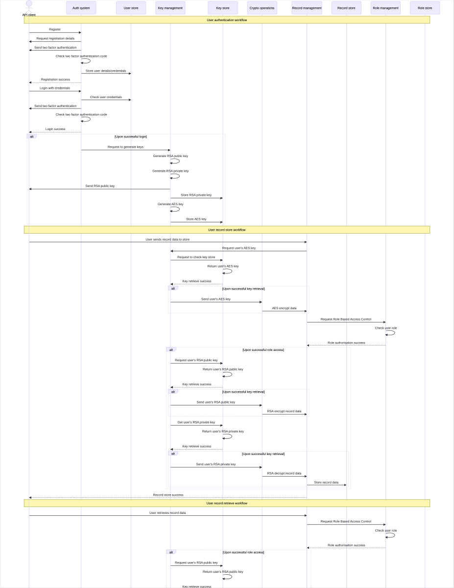
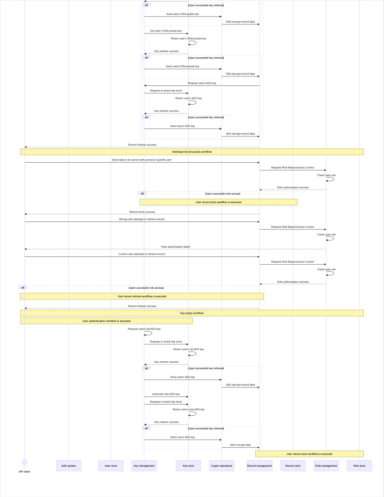

---

# 1 Introduction

This report provides a comprehensive narrative description of the proposed cryptographic simulation for the healthcare provider, St. John's Clinic. The design has been implemented in such a way that it addresses the key security gaps within the clinic's data protection requirements, in order to align with compliance standards, and provide robust safeguarding mechanisms to secure sensitive data, that is, patient personal information, medical prescriptions, financial transactions, research data, and so on.

A current analysis of the cybersecurity practices which St. John's Clinic need to implement for security enhancement falls into the following areas of:

- Authentication
- Key management (and its relevant key lifecycle stages)
- Role based access control
- Cryptographic encryption algorithms
- Secure data transmission

# 2 System description

For reference, please see [Appendix 5.1](#51-sequence-diagram) for the sequence diagram.

## 2.1 Authentication

A robust authentication framework means that only authorised users are allowed to interact with the system. It therefore regulates access to protected sensitive data and clinic services which should otherwise be inaccessible to unauthorised entities.

### 2.1.1 User registration

Under the assumption that any new users need to be registered securely with the system, a register function has been takes this into consideration. Since this is a simulation, the patient details this function processes are not that substantial to the overall functionality of the system, so only the following have been taken into account:

```python
def register_user(username, password, phone_number)
```

A `username` will help be a front-end unique identifier for users. A `password`, obviously, the user provides their custom password which will have the necessary hashing functions applied upon it. The `phone_number` parameter is just more placeholder registration data to fill out the JSON database entry.

To ensure that the username is unique, it reads the contents of the `USER_DB` JSON file and checks whether the chosen username exists or not – reflective of the actual clinic's system.

```python
users_data = data_read_return_empty_if_not_found(USER_DB)

if username in users_data:
    print(f"register.register_user -> Username '{username}' already exists. "
        f"Please choose a different username.")
    return
```

Since we want the authentication framework to be secure, a simulation of two factor authentication is implemented. The two functions that are called in the code below, `generate_2fa_code()` and `send_2fa_code()`, are simple functions that mimic the process. One generates the code and the other "sends" that code to the user's phone. In this case, there is no "sending", so a simple on-screen message is returned. The user then needs to simply repeat this code to the program console and depending upon the code verification, the function flow continues.

```python
two_factor_code = generate_2fa_code()
send_2fa_code(phone_number, two_factor_code)
entered_code = input("Enter the 2FA code: ")

if entered_code == two_factor_code:
    print("register.register_user -> 2FA verification successful.")
else:
    print("register.register_user -> 2FA verification failed. Registration aborted.")
    return
```

Preparation to store the data in the database takes place here. First using the `uuid` library allows the generation of a UUID 4, and this is converted to a string format. A salt is generated for the hashing of the password using the `bcrypt` library. Note that using `.encode('utf-8')` allows for the password to be converted to bytes first.

```python
user_id = str(uuid.uuid4())
salt = bcrypt.gensalt()
hashed_password = bcrypt.hashpw(password.encode('utf-8'), salt)
```

Finally, a new JSON object is created first as a Python dictionary. Note that the `hashed_password` and `salt` all have `.decode('utf-8')`, to allow them to be converted from bytes to strings. This is called JSON serialisation, since JSON does not support the storage of pure bytes.

Using another abstract function. `data_store()`, that I created to simplify file writing, this new JSON object is written to the JSON database file.

```python
new_user = {
    'user_id': user_id,
    'username': username,
    'hashed_password': hashed_password.decode('utf-8'),
    'salt': salt.decode('utf-8'),
    'phone_number': phone_number
}

users_data[username] = new_user
data_store(USER_DB, users_data)
```

For more detail on the full code implementation see [Appendix 5.3.1.1](#5311-registerpy).

### 2.1.2 User login

The user, with their newly created account via the `register()` function, can now use that to login into the system and access the relevant data. The only credentials that they require for this is their `username` and `password` as such. These are passed as parameters to the function.

```python
def login_user(username, password)
```

Based on the given parameters to the function, `login()` then checks if the username exists, and if not, appropriately terminates the program flow.

```python
if username not in users_data:
    print("login.login_user -> Username not found. Please register first.")
    return
```

Using the username and the JSON document, it attempts to get all of the user's data. This data is then used for further processing.

```python
user_data = users_data[username]
stored_password_hash = user_data['hashed_password']
salt = user_data['salt']
phone_number = user_data.get('phone_number', None)
```

Since the function is hashed, the `bcrypt` Python library's `.checkpw` function compares the bytes of the entered user's password against the stored hash in the JSON database. Only then will the post processing actions take place if the function returns true based on the hash.

```python
if bcrypt.checkpw(entered_password.encode('utf-8'), stored_password_hash.encode('utf-8'))
```

Since two factor authentication was proposed for a secure authentication framework, a simulation of sending the one time password code is "sent" to the user's mobile device. If the verification passes, then the an RSA key under the user's ID is generated and stored (see [2.2.1](#221-key-generation) and [2.2.2](#222-key-storage)) in the RSA HSM (Hardware Security Module). The `user_id` and `public_key` public key object is returned from the function for any post login actions.

```python
two_factor_code = generate_2fa_code()
send_2fa_code(phone_number, two_factor_code)
entered_code = input("Enter the 2FA code: ")

if entered_code == two_factor_code:
    print("login.login_user -> Login successful.")
    public_key = refresh_rsa_key(user_data["user_id"])
    return user_data['user_id'], public_key
```

For more detail on the full code implementation, see [Appendix 5.3.1.2](#5312-loginpy).

### 2.1.3 Single Sign-on (SSO)

For SSO, since homegrown SSO within the organisation was implemented, i.e, authentication with username and password, this SSO accounts for external authentication. Since this is the case, the below function os a simulation of this – only requiring a `username`. The backend identity management will be the responsibility of the third party company performing the authentication and returning the result of it.

```python
def single_sign_on(username)
```

The program flow is terminated if the username isn't found in the user database of the third party company.

```python
if username not in third_party_data:
    raise ValueError(f"sso.single_sign_on -> Username {username} not found. "
                    f"Please register with the third party provider first.")
```

The program flow continues if the above is not the case, and using the data content from the JSON file, it then makes a new user entry. The important here is to note that this JSON object has less fields than the regular authentication framework – this is the third party company's responsibility to implement and provide their own identity authentication or any other relevant user details. The important additional field, `third_party_status`, is important to note, as it helps to differentiate between a homegrown (i.e. internal within the company) SSO and an external SSO (i.e. external, such as Google or Facebook login).

```python
third_party_data = third_party_data[username]

if third_party_data:
    new_user = {
        'user_id': str(uuid.uuid4()),
        'username': username,
        'third_party_status': True
    }
```

Finally, this entry is written to the healthcare provider's normal user database.

```python
users_data[username] = new_user
data_store(USER_DB, users_data)
```

For more detail on the full code implementation, see [Appendix 5.3.1.3](#5313-ssopy).

## 2.2 Key management

For the chosen encryption algorithms, cryptographic keys serve need to have a well-defined key lifecycle, ensuring the security and integrity of these keys at every stage. Each phase of the lifecycle prevents unauthorised access, data collection or loss, with the aim of maintaining the confidentiality and integrity of these keys.

Since two different encryption algorithms, i.e. RSA and AES, are used, the key lifecycle stages are explained for each where applicable and implemented, but may have different characteristics.

### 2.2.1 Key generation

#### 2.2.1.1 AES

For AES, the key generation process is very simple. Using the Python built-in `os` library, the `urandom` function generates a random binary string of 32 bytes (i.e. 256 bits). Since this uses random logic, it is safe to say that this is cryptographically secure.

```python
def generate_aes_key():
    key = os.urandom(32)
    return key
```

For more detail on the full code implementation see [Appendix 5.3.2.1.1](#53211-key_genpy).

#### 2.2.1.2 RSA

For RSA, there is a dedicated library for all RSA encryption functions. Using the `rsa.generate_private_key` method, a new RSA private key is generated with the parameters enclosed within the brackets. `public_exponent` specifies the public exponent value used in the RSA algorithm. The value of `65537` is the default for most RSA keys. `key_size`, as the name suggests, is the size of the key in bits, so a value of `2048` is a standard size providing a adequate balance between both security and performance. Finally the `backend` parameter is set to `default_backend()`, which is the backend provided by the library to perform the generation process. A `public_key` can also be derived from the generated private key.

```python
def generate_key_pair():
    private_key = rsa.generate_private_key(
        public_exponent=65537,
        key_size=2048,
        backend=default_backend()
    )
    public_key = private_key.public_key()
    return private_key, public_key
```

For more detail on the full code implementation see [5.3.2.2](#5322-rsa_key_managerpy).

### 2.2.2 Key storage

#### 2.2.2.1 AES

To store the AES symmetric key, it needs to be stored under the corresponding user. This ensures a unique key for each user and can be accessed system-wide by the multiple clinic services, so that it can be consistent.

```python
def store_aes_key(user_id, key)
```

Using a simple `try` `catch` block, a file open is attempted in order to capture all the existing keys from the file. In the case that the file is not found, then it defaults the `json_data` variable to an empty JSON collection.

```python
try:
    with open(HSM_DB, 'r') as file:
        json_data = json.load(file)
except FileNotFoundError:
    json_data = {"aes_keys": []}
```

By iterating through the `aes_keys` JSON collection, if the `user_id` passed in parameter matches the `for` loop's index, it makes an entry for the key, but as a hex object using `.hex()`. This is because the key is passed in as raw bytes, and cannot be stored in the JSON file unless serialised. If not however, then a new entry is made in the `aes_keys` JSON collection, adding in the `user_id` and the `key` as a hex.

```python
for entry in json_data["aes_keys"]:
    if entry["user_id"] == user_id:
        entry["key"] = key.hex()
        break
    else:
        json_data["aes_keys"].append({"user_id": user_id, "key": key.hex()})
```

The function then writes the data to the appropriate key store file, which in this case is the `HSM_DB`.

```python
with open(HSM_DB, 'w') as file:
    json.dump(json_data, file, indent=2)
```

For more detail on the full code implementation see [5.3.2.1.2](#53212-key_storepy).

#### 2.2.2.2 RSA

The function that takes care of storing the RSA keys is the same to the AES key store function. This function below, `replace_or_insert_key_from_file()` takes in the `user_id` of the user which the key is stored under, `new_key` being the new RSA generated key from the previous `generate_key_pair()` function, and the `file_path` to the RSA key store.

```python
def replace_or_insert_key_from_file(user_id, new_key, file_path="data/rsa_hsm.json")
```

Following on from that, the logic of the function is exactly similar to the AES key store function so no further explanation is needed. One difference is the name in the JSON collection, from `aes_keys` to `rsa_keys` obviously.

However, one thing to note, is that since the `generate_key_pair()` function returns a the RSA public and private keys in a usable format, i.e. in bytes, it cannot be stored into JSON unless serialised. But in this instance, the RSA keys do not have a callable `.hex()` function so the Python RSA cryptographic library has its own specialised serialised function for this. Instead of bytes, it is converted into a PEM string format. The two functions below take this into account and perform the conversion.

Firstly for the RSA private key, using the `.private_bytes()` function, it takes a couple of arguments. The `encoding` parameter explicitly states that a PEM encoder should be used for a PEM output. The `format` parameter specifies the format for the private key, which in this case is `PKCS8` which is the widely used standard. Finally the `encryption_algorithm` parameter states that there should be no encryption applied to the RSA private key when converted to PEM since the assumption of the HSM (a simulated one) is used (see []() for further detail). At the end, it decodes the `pem_format` variable from bytes to string to be able to be stored in the JSON file.

```python
def pem_convert_private_key(key):
    pem_format = key.private_bytes(
        encoding=serialization.Encoding.PEM,
        format=serialization.PrivateFormat.PKCS8,
        encryption_algorithm=serialization.NoEncryption()
    )
    return pem_format.decode('utf-8')
```

The same applies when converting the RSA public key to a PEM format, but this time using the `.private_bytes()` method. The `encoding` parameter in this case remains the same, since a PEM output is required. The `format` parameter however, since this is a public key, is different to the previous value, since this time the standard format suitable for public keys is used. And again, it performs the bytes to string conversion for JSON serialisation.

```python
def pem_convert_public_key(key):
    pem_format = key.public_bytes(
        encoding=serialization.Encoding.PEM,
        format=serialization.PublicFormat.SubjectPublicKeyInfo
    )
    return pem_format.decode('utf-8')
```

For more detail on the full code implementation see [5.3.2.2](#5322-rsa_key_managerpy).

### 2.2.3 Key retrieval

#### 2.2.3.1 AES

The stored AES keys need to be retrieved for any symmetric encryption processes for the relevant user. This allows for the same key to be used across all the various clinic systems.

As mentioned, this function will accept a `user_id` parameter to return the key for the given user.

```python
def retrieve_key(user_id)
```

For this, a simple file read takes place, iterating through the JSON file via a `for` loop. `key_entries` uses a `data_read` utility function to capture all the data from the JSON file (or simulated HSM, see []() for more information). By looping through, it checks for the matching `user_id` and then returns the key in a usable format, i.e. converting it from the stored hex into its original bytes form.

```python
key_entries = data_read(HSM_DB)

for entry in key_entries["aes_keys"]:
    if entry["user_id"] == user_id:
        return bytes.fromhex(entry["key"])
```

For more detail on the full code implementation see [5.3.2.1.3](#53213-key_retrievepy).

#### 2.2.3.2 RSA

Although there is no explicit function in the `rsa_manager.py` file for key retrieval, wherever required, a simple JSON file read was sufficient enough to obtain the key.

For example, in an RSA decryption function implemented later on (see [2.3](#23-data-transmission)), a simple `for` loop iterating through the JSON file was enough. This same logic is implemented seperately as a function for the AES `retrieve_key()` module (see [2.2.3.1](#2231-aes)).

```python
for key_info in rsa_hsm_data["rsa_keys"]:
    if key_info["user_id"] == owner_id:
        private_key_pem = key_info["key"]
```

What was the main problem was the conversion between the PEM string into a usable RSA key format from the JSON serialisation. The following two function address this.

Below, this function takes in the RSA private key's `pem_string` as a parameter and utilises the cryptographic library's `.load_pem_private_key()` method to load the private key object. The `pem_string` is converted into bytes via `.encode()` since the function expects data in binary form, allowing any non-textual characters or special formatting within the PEM data are preserved accurately. `password` being set to `None` means that there is no password protection applied, which is consistent with the fact that no encryption algorithm was applied in the PEM conversion. As before in [2.2.1.2](#2212-rsa), the `backend` uses the library's default.

```python
def load_private_key_from_pem_string(pem_string):
    private_key = serialization.load_pem_private_key(
        pem_string.encode(),
        password=None,
        backend=default_backend()
    )
    return private_key
```

The counterpart function, for the RSA public key, is more or less the same. Key differences being the method, `.load_pem_public_key()`, and the omittance of the `password` parameter.

```python
def load_public_key_from_pem_string(pem_string):
    public_key = serialization.load_pem_public_key(
        pem_string.encode(),
        backend=default_backend()
    )
    return public_key
```

For more detail on the full code implementation see [5.3.2.2](#5322-rsa_key_managerpy).

### 2.2.4 Key expiry rotation

#### 2.2.4.1 AES

The AES keys stored in the HSM need to be rotated and expired periodically in order to be cryptographically secure. In the event the HSM is breached and access to the AES key is gained, since the key has been rotated, the data still cannot be decrypted regardless.

This function needs to know the correct `user_id` in order to find the AES key of the user to expire.

```python
def expire_aes_key(user_id)
```

By using the previous `retrieve_key()` function in [2.2.3.1](#2231-aes), it gets the user's current AES key, and labels in a variable called `old_aes_key`, since the key will expire soon. Now using the `generate_aes_key()` function from [2.2.1.1](#2211-aes), a new AES key is generated that will replace the previous one.

```python
old_aes_key = retrieve_key(user_id)
new_aes_key = generate_aes_key()
```

By looping through a JSON file containing data used by the various clinical systems, i.e. records (see [2.3](#23-record-management)), the `if` statement helps to determine the right record based on the `user_id`. By getting the data from the `data` field of the JSON object, the old AES key is used to decrypt and replace the contents of the field with its original plaintext form using the `aes_data_decrypt` function (see [2.3.2](#232-decryption)).

```python
for record in records_data["records"]:
    if record["owner_id"] == user_id:
        record["data"] = aes_data_decrypt(old_aes_key, record["data"])
```

Now that the data is in its plaintext form, the `new_aes_key` can be used to encrypt the plaintext into a new cipher text form using the `aes_encrypt` function (see [2.3.1](#231-encryption)). Note that using the `.encode()` method, the plaintext has to be converted into bytes. However, a problem arises in that raw bytes cannot be stored in JSON file so serialisation is required. Using Python's `base64` library and the relevant method, `b64encode()`, it encodes the cipher text into Base64 binary data. The `.decode()` function will turn this into a string from bytes. Finally, the `data` attribute of the `record` JSON object is overwritten with the new cipher text.

```python
if record["owner_id"] == user_id:
    # ...previous code

    ciphertext = aes_encrypt(new_aes_key, record["data"].encode())
    serialized_ciphertext = base64.b64encode(ciphertext).decode()
    record["data"] = serialized_ciphertext
```

For more detail on the full code implementation, see [5.3.2.1.4](#53214-key_expirepy).

#### 2.2.4.2 RSA

For RSA, there is no explicit key expiry implemented. This is because each time the user logins, both their RSA public and private keys are dynamically refreshed and re-generated (see [2.1.2](#212-user-login)).

## 2.3 Record management

In this system, data is organised into data records, which serve as the fundamental units of information storage. Users from the various clinical services interacting with the system, have the capability to both create new records and store them within the system's database, as well as retrieve existing records as needed. These records are structured as JSON objects.

### 2.3.1 Encryption

For data at rest, AES symmetric encryption has been used, and the following function performs this operation. Parameters include `key`, being the user's generated AES key, and the plaintext `data` to encrypt.

```python
def aes_encrypt(key, data)
```

Simple exception handling is implemented, checking whether the AES key length is 32. This also gives assurance that the AES key is only generated by the corresponding function (see [2.2.2.1](#2221-aes)) within the crypto system and no external keys are being used – the key cannot be manipulated or corrupted by malicious actors. If data is encrypted with an invalid key, the cipher text is corrupted and cannot be recovered to its original state, so therefore this prevents the malformed cipher text from propagating throughout the different clinical systems.

```python
if len(key) != 32:
    raise ValueError("AES key must be 32 bytes long for AES-256")
```

A new initialisation vector is created using the `os` Python library to create a random to create a random binary string (like in [2.2.2.1](#2211-aes)) of 16 bytes (or 128 bits). An initialisation vector ensures cryptographic randomness and true variance in the different cipher texts generated, so each encrypted piece of data is truly unique.

```python
iv = os.urandom(16)
```

Here, a new cryptographic cipher is created, which is an object that can perform the encryption process. The `algorithms.AES(key)` parameter means that this encryption should use AES symmetric encryption with the given `key`. With `modes.CFB(iv)`, it ensures that it uses CFB (Cipher Feedback) mode of operation for block ciphers with the initialisation vector passed in. Finally, the `backend` is the cryptographic library's default (similar in [2.2.1.2](#2212-rsa) RSA key generation).

```python
cipher = Cipher(algorithms.AES(key), modes.CFB(iv), backend=default_backend())
```

A new encryptor is created from the previous initialised cipher object. This will perform the necessary encryption for the given `data`.

```python
encryptor = cipher.encryptor()
```

To actually create the cipher text, the newly created `encryptor` will take the plain text input of `data` and returns the corresponding cipher text with the chosen encryption settings from the `cipher` variable. The `encryptor.finalize()` method finalises the process, ensuring that any remaining data within the internal bugger of the `encryptor` is also processed and included within the cipher text output.

```python
ciphertext = encryptor.update(data) + encryptor.finalize()
```

The final, true form of the cipher text is returned, as a concatenation of the initialisation vector and the newly generated cipher text. This will be required in the decryption process (see [2.3.2](#232-decryption)).

```python
return iv + ciphertext
```

For more detail on the full code implementation, see [5.3.3.1](#5331-encryptionpy).

### 2.3.2 Decryption

Since AES symmetric encryption was used, the relevant decryption operation has to be performed to convert the cipher text output to its original readable plain text input. This function again, takes the same arguments as `aes_encrypt`.

```python
def aes_data_decrypt(aes_key, data)
```

As the `data` parameter will take the value of serialised cipher text from the JSON object, it needs to be unserialised in the same way, and that is again by decoding via Base64. This ensures that the cipher text is in its original form.

```python
ciphertext = base64.b64decode(data)
```

Since in `aes_encrypt` the final cipher text was a combination of the initialisation vector and the cipher text components (see [2.3.1](#231-encryption)), using string splicing, the cipher text is appropriately split up in half, of length 16 characters – the size of the initialisation vector and the actual cipher text are both 16 (see [2.3.1](#231-encryption)), so in total, 32 characters.

```python
iv = ciphertext[:16]
actual_ciphertext = ciphertext[16:]
```

Again, as explained in [2.3.1](#231-encryption), the `aes_key` is checked to see if it is of the correct length to ensure that malformed data does not traverse the system.

```python
if len(aes_key) != 32:
    raise ValueError("AES key must be 32 bytes long for AES-256")
```

Like before in [2.3.1](#231-encryption), a cipher object must be formed again using the exact same parameters and values.

```python
cipher = Cipher(algorithms.AES(aes_key), modes.CFB(iv), backend=default_backend())
```

This time however, a `decryptor` is made since the required operation is decryption. This via the `.decryptor()` method of the cipher object.

```python
decryptor = cipher.decryptor()
```

Using this `decryptor` and the decryption configuration from the `cipher` variable, the decryption process is performed in the exact same way as the encryption process, but with the `actual_ciphertext` spliced component of the passed in cipher text.

```python
decrypted_data = decryptor.update(actual_ciphertext) + decryptor.finalize()
```

Finally, as the `decryptor` returns the plain text in bytes, using `decode()`, it converts this back into a string, so that it can be read.

```python
return decrypted_data.decode()
```

For more detail on the full code implementation, see [5.3.3.2](#5332-decryptionpy).

### 2.3.3 Role Based Access Control (RBAC)

The Role Based Access Control (RBAC), is a method of access control where users are granted certain privileges or access to specific system properties based on the permissions they have. Access decisions are solely dependent on the user's permissions rather than the actual identity of the users themselves. This approach allows for easier access management since permissions can be quickly assigned or revoked by administrators.

The RBAC for this simulation has been implemented as a Python wrapper function or decorator. For instance, if there was a decorator called `function_x` and a normal function called `function_y`, if `function_x` is wrapped around `function_y`, each time `function_y` is called and executed `function_x` will also be called and executed (either before or after, depending on how it is wrapped). This allows for additional functionality and flexibility. The decisioning for this implementation is that the RBAC needs to be called each time a user attempts to perform a record operation (see [2.3.4](#234-store-records) and [2.3.5](#235-retrieve-records)) – they are only able to do so if they have the necessary permissions.

A wrapper function is defined like so. The `role_check_decorator` takes in a `func` parameter, meaning it takes in another whole function as a parameter. The inner `wrapper` function either modifies or extends the behavior of the function is is called upon, taking in `owner_id` (owner of the record, see [2.3.4](#234-store-records)), `*args` and `**kwargs` to accept any number of extra positional arguments.

```python
def role_check_decorator(func):
    def wrapper(owner_id, *args, **kwargs):
```

This `try` `catch` block attempts to open and capture data of the necessary JSON files, those being `USER_ROLES_DB` (a database containing the user IDs and any associated roles) and `ROLE_PERMISSIONS_DB` (a database containing information on all available system roles). If there is an error with this operation, then terminate the program.

```python
try:
    with open(USER_ROLES_DB, 'r') as user_roles_file:
        user_roles_data = json.load(user_roles_file)

    with open(ROLE_PERMISSIONS_DB, 'r') as role_permissions_file:
        role_permissions_data = json.load(role_permissions_file)

except FileNotFoundError:
    print(f"role_check.role_check_decorator -> {USER_ROLES_DB} database or {ROLE_PERMISSIONS_DB} database not "
            f"found.")
    return
```

To start the role access logic, first, the owner of the record or rather, whichever user is attempting to perform a record operation should be first checked to see if they exist and have roles allocated to them. If this is the case, then store all the available user roles into a variable.

```python
if owner_id in user_roles_data:
    user_roles = user_roles_data[owner_id]["roles"]
else:
    print(f"role_check.role_check_decorator -> User with ID {owner_id} not found in user roles data.")
```

By looping through the user roles database, first check if role actually exists within the database. If so, then from the function that the decorator function is wrapped around, gets the `permission` parameter with `kwargs.get()`. As the permissions in the role permissions database are stored in capital letters, the `.upper()` ensures that it is in the same case regardless of the parameter value.

```python
if owner_id in user_roles_data:
    # ...previous code

    for role in user_roles:
        if role in role_permissions_data:
            permission_name = kwargs.get("permission", "").upper()
        else:
            print(f"role_check.role_check_decorator -> Role {role} not found in role permissions data.")
```

The function then checks whether the claimed permission passed to the original function is indeed within the permissions of that specific role. If so then control is passed back to the original function and the program flow resumes as normal – the user does have the necessary role. However, if this isn't the case, then a special `PermissionError` can be raised, terminating the execution – the user does not have the necessary roles.

```python
if role in role_permissions_data:
    # ...previous code

    if permission_name in role_permissions_data[role]["permissions"]:
        return func(owner_id, *args, **kwargs)
    else:
        raise PermissionError(
                            f"role_check.role_check_decorator -> User with ID {owner_id} does not have required "
                            f"permissions for this operation.")
```

Finally, once all the logic has been performed, then the `wrapper` function needs to be returned as this allows the logic within the `wrapper` function to be executed if any function is decorated with it.

```python
return wrapper
```

To call this wrapper function upon other functions, the syntax is like so.

```python
@role_check_decorator
def record_store(...)
```

For more detail on the full code implementation, see [5.3.3.3](#5333-role_checkpy).

### 2.3.4 Store records

### 2.3.5 Retrieve records

## 2.4 Data transmission

### 2.4.1 Encryption

### 2.4.2 Decryption

# 3 Addressing requirements

## 3.1 Cryptographic algorithms and protocols

## 3.2 Compliance and standards

# 4 Assumptions taken

# 5 Appendices

## 5.1 Sequence diagram




## 5.2 GitHub repository

Link to GitHub repository, containing full code and installation documentation.

[iss-cw3 GitHub repository](https://github.com/iArcanic/iss-cw)

## 5.3 Implementation source code

### 5.3.1 Authentication

#### 5.3.1.1 `register.py`

```python
import uuid

import bcrypt

from src.authentication.two_fa import generate_2fa_code, send_2fa_code
from src.data_manager import *

# User database simulation
USER_DB = "data/user_db.json"


def register_user(username, password, phone_number):
    users_data = data_read_return_empty_if_not_found(USER_DB)

    # Check if the username already exists in the database
    if username in users_data:
        print(f"register.register_user -> Username '{username}' already exists. "
            f"Please choose a different username.")
        return

    # Generate a 2FA code
    two_factor_code = generate_2fa_code()

    # Simulate sending the 2FA code to the user
    send_2fa_code(phone_number, two_factor_code)

    # Prompt the user to enter the received 2FA code
    entered_code = input("Enter the 2FA code: ")

    # Check if the entered code matches the generated 2FA code
    if entered_code == two_factor_code:
        print("register.register_user -> 2FA verification successful.")
    else:
        print("register.register_user -> 2FA verification failed. Registration aborted.")
        return

    # Generate a unique user_id using UUID
    user_id = str(uuid.uuid4())

    # Generate a random salt
    salt = bcrypt.gensalt()

    # Combine the password with the salt and hash it
    hashed_password = bcrypt.hashpw(password.encode('utf-8'), salt)

    # Create a new user entry
    new_user = {
        'user_id': user_id,
        'username': username,
        'hashed_password': hashed_password.decode('utf-8'),  # Convert bytes to string for JSON serialization
        'salt': salt.decode('utf-8'),  # Convert bytes to string for JSON serialization
        'phone_number': phone_number
    }

    # Add the new user to the database
    users_data[username] = new_user

    # Save the updated database to the file
    data_store(USER_DB, users_data)

    print(f"register.register_user -> User '{username}' registered successfully. "
          f"Login with your new account to continue.")
```

#### 5.3.1.2 `login.py`

```python
import bcrypt

from src.authentication.two_fa import generate_2fa_code, send_2fa_code
from src.data_manager import *
from src.key_management.rsa_key_manager import *

# User database simulation
USER_DB = "data/user_db.json"


def login_user(username, password):
    users_data = data_read(USER_DB)

    # Check if the username exists in the database
    if username not in users_data:
        print("login.login_user -> Username not found. Please register first.")
        return

    if username in users_data and "third_party_status" in users_data[username]:
        print("login.login_user -> Please use SSO to login.")
        return

    user_data = users_data[username]
    stored_password_hash = user_data['hashed_password']
    salt = user_data['salt']
    phone_number = user_data.get('phone_number', None)

    # Get the user's password
    if password is None:
        entered_password = input("Enter your password: ")
    else:
        entered_password = password

    # Verify the entered password
    if bcrypt.checkpw(entered_password.encode('utf-8'), stored_password_hash.encode('utf-8')):
        # If the password is correct, proceed with 2FA verification
        two_factor_code = generate_2fa_code()
        send_2fa_code(phone_number, two_factor_code)

        entered_code = input("Enter the 2FA code: ")

        if entered_code == two_factor_code:
            print("login.login_user -> Login successful.")
            # Every time the user logins the RSA key is regenerated
            # Used for transferring data across multiple clinic services
            public_key = refresh_rsa_key(user_data["user_id"])
            return user_data['user_id'], public_key
        else:
            print("login.login_user -> 2FA verification failed. Login aborted.")
    else:
        print("login.login_user -> Incorrect password. Login aborted.")
```

### 5.3.1.3 `sso.py`

```python
import uuid

from src.data_manager import *

# Third party provider database simulation
THIRD_PARTY_DB = "data/third_party_db.json"

# User database simulation
USER_DB = "data/user_db.json"


def single_sign_on(username):
    # Read all user entries from the third party provider database
    third_party_data = data_read(THIRD_PARTY_DB)

    # Read all user entries from the Users database
    users_data = data_read_return_empty_if_not_found(USER_DB)

    if username not in third_party_data:
        raise ValueError(f"sso.single_sign_on -> Username {username} not found. "
                        f"Please register with the third party provider first.")

    # Get the correct user entry
    third_party_data = third_party_data[username]

    if third_party_data:
        # Make a new entry
        new_user = {
            'user_id': str(uuid.uuid4()),
            'username': username,
            'third_party_status': True
        }

        # Make a new entry in the Users database
        users_data[username] = new_user

        # Add the new SSO user to the database
        data_store(USER_DB, users_data)

        # Third party identity provider would do their own authentication logic here
        print("sso.single_sign_on -> Third party authentication successful "
                "Authentication logic by the third party provider.")
    else:
        # Terminate on unsuccessful SSO login
        print("sso.single_sign_on -> Third party authentication failed. SSO login aborted.")
```

### 5.3.2 Key management

#### 5.3.2.1 AES key functions

##### 5.3.2.1.1 `key_gen.py`

```python
import os


def generate_aes_key():
    key = os.urandom(32)
    return key
```

##### 5.3.2.1.2 `key_store.py`

```python
import base64

from src.decryption import aes_data_decrypt
from src.encryption import aes_encrypt
from src.key_management.key_gen import generate_aes_key
from src.key_management.key_retrieve import *

# Hardware Security Module (HSM) for AES keys simulation
HSM_DB = "data/hsm.json"

# Records database simulation
RECORDS_DB = "data/records_db.json"


def store_aes_key(user_id, key):
    try:
        with open(HSM_DB, 'r') as file:
            # Read all key entries from HSM
            json_data = json.load(file)
    except FileNotFoundError:
        # If file is not found then make an empty aes_keys JSON collection
        json_data = {"aes_keys": []}

    for entry in json_data["aes_keys"]:
        if entry["user_id"] == user_id:
            # Store AES key as hex in database
            entry["key"] = key.hex()
            break
        else:
            # If user_id not found, insert a new entry using the given AES key
            json_data["aes_keys"].append({"user_id": user_id, "key": key.hex()})

    with open(HSM_DB, 'w') as file:
        json.dump(json_data, file, indent=2)
```

##### 5.3.2.1.3 `key_retrieve.py`

```python
from src.data_manager import *

# Hardware Security Module (HSM) for AES keys simulation
HSM_DB = "data/hsm.json"


def retrieve_key(user_id):
    # Read all key entries from HSM
    key_entries = data_read(HSM_DB)

    for entry in key_entries["aes_keys"]:
        # Get the correct record
        if entry["user_id"] == user_id:
            # Return AES key from hex into a usable format
            return bytes.fromhex(entry["key"])

    print(f"key_retrieve.retrieve_key -> Key for user {user_id} not found in {HSM_DB}!")
    return None
```

##### 5.3.2.1.4 `key_expire.py`

> NOTE: The `expire_aes_key` function is implemented within the `key_store.py` (see [5.3.2.1.2](#53212-key_storepy)) rather than in its own separate file. For clarity and understanding purposes, it has been presented in here as its own distinct file.

```python
import base64

from src.decryption import aes_data_decrypt
from src.encryption import aes_encrypt
from src.key_management.key_gen import generate_aes_key
from src.key_management.key_retrieve import *

# Hardware Security Module (HSM) for AES keys simulation
HSM_DB = "data/hsm.json"

# Records database simulation
RECORDS_DB = "data/records_db.json"

# This has to be highly transactional.
# For any failures, old key should be rolled back, including data encryption and decryption
def expire_aes_key(user_id):

    # Read all record entries from Records database
    records_data = data_read(RECORDS_DB)

    # Get AES old key
    old_aes_key = retrieve_key(user_id)

    # Make a new AES key
    new_aes_key = generate_aes_key()

    # Store new key under the given user_id
    store_aes_key(user_id, new_aes_key)

    for record in records_data["records"]:
        # Get the correct record
        if record["owner_id"] == user_id:
            # Decrypt the data of that record with the old AES key
            record["data"] = aes_data_decrypt(old_aes_key, record["data"])

            # Encrypt the data of that record with the new key
            ciphertext = aes_encrypt(new_aes_key, record["data"].encode())

            # Serialise the ciphertext so it can be stored as JSON
            serialized_ciphertext = base64.b64encode(ciphertext).decode()

            # Overwrite the data of that record with the new serialised ciphertext
            record["data"] = serialized_ciphertext

    # Write to Records database
    data_store(RECORDS_DB, records_data)
```

#### 5.3.2.2 `rsa_key_manager.py`

```python
import json

from cryptography.hazmat.backends import default_backend
from cryptography.hazmat.primitives import hashes
from cryptography.hazmat.primitives import serialization
from cryptography.hazmat.primitives.asymmetric import padding
from cryptography.hazmat.primitives.asymmetric import rsa


def replace_or_insert_key_from_file(user_id, new_key, file_path="data/rsa_hsm.json"):
    try:
        with open(file_path, 'r') as file:
            json_data = json.load(file)
    except FileNotFoundError:
        json_data = {"rsa_keys": []}

    for entry in json_data["rsa_keys"]:
        # Get the correct user entry
        if entry["user_id"] == user_id:
            # Store the new RSA key in JSON object in RSA HSM
            entry["key"] = new_key
            break
    else:
        # If user_id not found, insert a new entry
        json_data["rsa_keys"].append({"user_id": user_id, "key": new_key})

    # Write to RSA HSM
    with open(file_path, 'w') as file:
        json.dump(json_data, file, indent=2)


# Convert private key bytes into PEM format to be stored in JSON
def pem_convert_private_key(key):
    # Get RSA private key bytes
    pem_format = key.private_bytes(
        encoding=serialization.Encoding.PEM,
        format=serialization.PrivateFormat.PKCS8,
        encryption_algorithm=serialization.NoEncryption()
    )
    # Convert bytes into string
    return pem_format.decode('utf-8')


# Convert public key bytes into PEM format to be stored in JSON
def pem_convert_public_key(key):
    # Get RSA public key bytes
    pem_format = key.public_bytes(
        encoding=serialization.Encoding.PEM,
        format=serialization.PublicFormat.SubjectPublicKeyInfo
    )
    # Convert bytes into string
    return pem_format.decode('utf-8')


# Refresh RSA public and private keys when the user logins in PEM format
def refresh_rsa_key(user_id):
    # Generate new RSA key pair
    private_key, public_key = generate_key_pair()

    # Convert RSA private key into PEM format
    private_key_pem = pem_convert_private_key(private_key)

    # Store new RSA private key into RSA HSM under the given user_id
    replace_or_insert_key_from_file(user_id, private_key_pem)

    return pem_convert_public_key(public_key)


# Generate an RSA public and private key pair
def generate_key_pair():
    private_key = rsa.generate_private_key(
        public_exponent=65537,
        key_size=2048,
        backend=default_backend()
    )
    public_key = private_key.public_key()
    return private_key, public_key


# Encrypt with RSA public key
def rsa_encrypt(data, public_key_pem):
    public_key = load_public_key_from_pem_string(public_key_pem)
    ciphertext = public_key.encrypt(
        # Data as hex
        data.encode(),
        padding.OAEP(
            mgf=padding.MGF1(algorithm=hashes.SHA256()),
            algorithm=hashes.SHA256(),
            label=None
        )
    )
    return ciphertext


def rsa_decrypt(ciphertext, private_key_pem):
    private_key = load_private_key_from_pem_string(private_key_pem)
    plaintext = private_key.decrypt(
        ciphertext,
        padding.OAEP(
            mgf=padding.MGF1(algorithm=hashes.SHA256()),
            algorithm=hashes.SHA256(),
            label=None
        )
    )
    # Convert from bytes to string
    return plaintext.decode("utf-8")


# Convert RSA private key from string to key object
def load_private_key_from_pem_string(pem_string):
    private_key = serialization.load_pem_private_key(
        # Convert to bytes
        pem_string.encode(),
        password=None,
        backend=default_backend()
    )
    return private_key


# Convert RSA public key from string to key object
def load_public_key_from_pem_string(pem_string):
    public_key = serialization.load_pem_public_key(
        # Convert to bytes
        pem_string.encode(),
        backend=default_backend()
    )
    return public_key
```

### 5.3.3 Record management

#### 5.3.3.1 `encryption.py`

```python
import os

from cryptography.hazmat.backends import default_backend
from cryptography.hazmat.primitives.ciphers import Cipher, algorithms, modes


# AES data encryption operation
def aes_encrypt(key, data):
    # Check whether the AES key is of the required length
    if len(key) != 32:
        raise ValueError("AES key must be 32 bytes long for AES-256")

    # Create a new initialisation vector of 16 characters
    iv = os.urandom(16)

    # Create a new cipher with the AES key and initialisation vector
    cipher = Cipher(algorithms.AES(key), modes.CFB(iv), backend=default_backend())

    # Make a new encrypter with that cipher to encrypt the data
    encryptor = cipher.encryptor()
    ciphertext = encryptor.update(data) + encryptor.finalize()

    # Concatenate the IV and ciphertext to form the final ciphertext
    return iv + ciphertext
```

#### 5.3.3.2 `decryption.py`

```python
import base64

from src.encryption import *


# AES data decryption operation
def aes_data_decrypt(aes_key, data):
    # Base64 decode the encrypted data
    ciphertext = base64.b64decode(data)
    print(f"record_store.record_store -> Encrypted data at rest {ciphertext}")

    # Splice the initialisation vector from the cipher text
    iv = ciphertext[:16]

    # Splice the actual encrypted data content from the ciphertext
    actual_ciphertext = ciphertext[16:]

    # Check whether the AES key is of the required length
    if len(aes_key) != 32:
        raise ValueError("AES key must be 32 bytes long for AES-256")

    # Create a new AES cipher using the AES key and IV
    cipher = Cipher(algorithms.AES(aes_key), modes.CFB(iv), backend=default_backend())

    # Make a new decrypter with that cipher to decrypt the data
    decryptor = cipher.decryptor()
    decrypted_data = decryptor.update(actual_ciphertext) + decryptor.finalize()

    # Decode the plaintext to string from bytes
    plaintext = decrypted_data
    return plaintext.decode()
```

#### 5.3.3.3 `role_check.py`

```python
import json

# User roles database simulation
USER_ROLES_DB = "data/user_roles_db.json"

# Role permissions database simulation
ROLE_PERMISSIONS_DB = "data/role_permissions_db.json"


def role_check_decorator(func):
    def wrapper(owner_id, *args, **kwargs):
        try:
            with open(USER_ROLES_DB, 'r') as user_roles_file:
                # Get all the users with their relevant allocated roles
                user_roles_data = json.load(user_roles_file)

            with open(ROLE_PERMISSIONS_DB, 'r') as role_permissions_file:
                # Get all permissions
                role_permissions_data = json.load(role_permissions_file)

        except FileNotFoundError:
            print(f"role_check.role_check_decorator -> {USER_ROLES_DB} database or {ROLE_PERMISSIONS_DB} database not "
                  f"found.")
            return

        if owner_id in user_roles_data:
            # Get all the roles which the user has been granted
            user_roles = user_roles_data[owner_id]["roles"]

            for role in user_roles:
                # Check if the role exists
                if role in role_permissions_data:
                    # Check if the function's name corresponds to a permission
                    permission_name = kwargs.get("permission", "").upper()
                    # Get the correct permission from permissions database
                    if permission_name in role_permissions_data[role]["permissions"]:
                        # Return to the original function
                        return func(owner_id, *args, **kwargs)
                    else:
                        # Terminate the program if the user does not have the relevant role
                        raise PermissionError(
                            f"role_check.role_check_decorator -> User with ID {owner_id} does not have required "
                            f"permissions for this operation.")
                else:
                    # Terminate the program if the role is not found
                    print(f"role_check.role_check_decorator -> Role {role} not found in role permissions data.")
        else:
            # Terminate the program if the user is not found
            print(f"role_check.role_check_decorator -> User with ID {owner_id} not found in user roles data.")

    return wrapper
```

### 5.3.4 Data transmission

# 6 References
